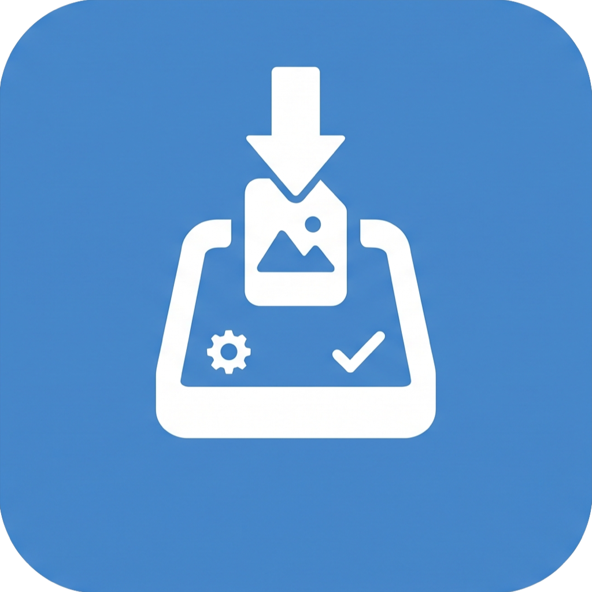

# HEICをJPEGへ縮小圧縮するだけ.app

<p align="center">
  <a href="https://github.com/shoppie70/HeicToJpegCompressor/releases/download/v1.1.1/HeicToJpegCompressor-v1.1.1.dmg">
    
  </a>
</p>

<p align="center">
  <strong>iPhone写真をドロップするだけで、軽くて使いやすいJPEGに。</strong><br>
  HEICをJPEGへ変換し、ちょうどよい大きさに縮小・圧縮する、ローカル完結のmacOSアプリです。
</p>

<p align="center">
  <a href="https://github.com/shoppie70/HeicToJpegCompressor/releases/download/v1.1.1/HeicToJpegCompressor-v1.1.1.dmg"><strong>DMGをダウンロード（v1.1.1）</strong></a><br>
  macOS 14 Sonoma以降・Apple Silicon / Intel Mac対応 · 無料 · 画像はMacの外へ送信しません
</p>

<p align="center">
  <a href="https://shoppie70.github.io/HeicToJpegCompressor/">Webサイト</a> · <a href="#インストール">インストール方法</a> · <a href="#使い方">使い方</a> · <a href="https://github.com/shoppie70/HeicToJpegCompressor">ソースコード</a>
</p>

> [!IMPORTANT]
> 現在のDMGは **Apple Silicon / Intel Mac対応のUniversal版** です。個人開発のためAppleによる公証はされておらず、初回起動時にmacOSの警告が表示されることがあります。対処方法は[インストール](#インストール)を参照してください。

---

## 何をしてくれる？

HEIC / HEIF / JPEG / JPG / PNGをアプリへドロップすると、元画像と同じフォルダにJPEGを保存します。複数枚の一括処理にも対応します。

| 初期設定 | 内容 |
| --- | --- |
| 出力 | JPEG（`IMG_1234_compressed.jpg`） |
| リサイズ | 最大長辺 1980px。小さい画像は拡大しない |
| 圧縮 | JPEG品質 0.85 |
| プライバシー | EXIF・GPS・撮影日時などのmetadataを削除 |
| 保存 | 元画像は変更せず、同じフォルダへ保存 |

最大長辺とJPEG品質はアプリ内で変更できます。EXIF Orientationをピクセルに反映するため、metadataを削除しても見た目の向きを維持します。

## インストール

1. [HeicToJpegCompressor-v1.1.1.dmg をダウンロード](https://github.com/shoppie70/HeicToJpegCompressor/releases/download/v1.1.1/HeicToJpegCompressor-v1.1.1.dmg)して開きます。
2. `HEICをJPEGへ縮小圧縮するだけ.app` を `Applications` フォルダへドラッグします。
3. `Applications` から `HEICをJPEGへ縮小圧縮するだけ` を起動します。

> [!NOTE]
> 初回起動時に「開発元を確認できないため開けません」と表示された場合は、［システム設定］>［プライバシーとセキュリティ］>［このまま開く］を選択してください。これは未公証の個人開発アプリに対するmacOSの通常の保護です。

## 使い方

1. `HEICをJPEGへ縮小圧縮するだけ` を起動します。
2. HEIC / HEIF / JPEG / JPG / PNGをウィンドウ、またはDockのアイコンへドロップします。
3. 同じフォルダに `*_compressed.jpg` ができます。

変換のたびに保存先や品質を聞きません。元ファイルも上書きしません。

## なぜ作った？

変換サイトも、Squooshも、もう開かない。

iPhoneで撮った写真をMacへ持ってきて、メルカリの商品写真、Slack、ブログなどに使おうとすると、HEICのままでは使えないことがある。そのままでは解像度もファイルサイズも大きすぎる。

以前は毎回、変換サイトでJPEGにして、必要ならSquooshで縮小・圧縮していました。便利なツールはすでにある。でも、あるとき気づきました。

> **なんで毎回、同じことを手でやってるんだ？**

```text
以前: HEIC → 変換サイト → JPEG → Squoosh → 縮小・圧縮
いま: HEIC → HEICをJPEGへ縮小圧縮するだけへドロップ → JPEG
```

欲しかったのは高機能な画像編集ソフトではありません。写真を放り込んだら、だいたいどこでも普通に使いやすいJPEGになって返ってくること。それだけです。

## しないこと

- トリミング、フィルター、AI補正
- クラウドへのアップロード、アカウント作成
- 変換ごとの保存先・品質の確認

JPEGにして、ちょうどいいサイズにして、軽くする。それだけです。

## 開発者向け

SwiftUI、ImageIO、Core Graphics、VisionなどのApple標準フレームワークだけで実装しています。macOS 14以降とXcodeがあれば、ソースからも起動できます。

```bash
git clone https://github.com/shoppie70/HeicToJpegCompressor.git
cd HeicToJpegCompressor
open HeicToJpegCompressor.xcodeproj
```

Xcodeで `HeicToJpegCompressor` スキームを選び、`⌘R` で実行してください。変換ロジックのテストは `swift test` で実行できます。
