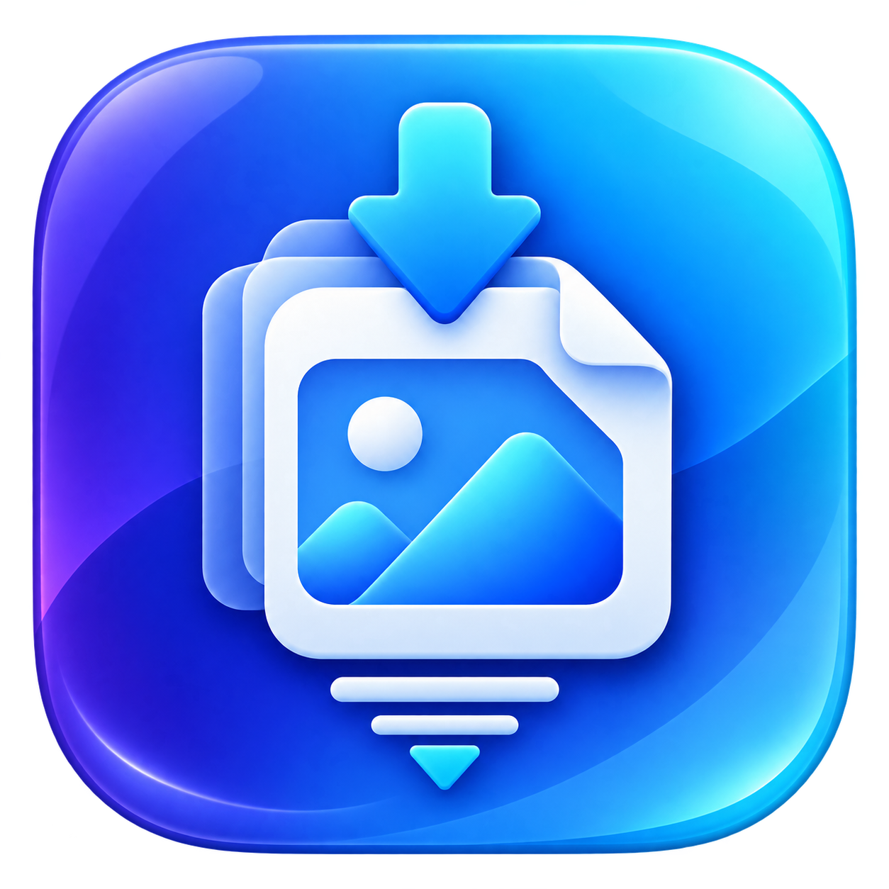

# HEICをJPEGへ縮小圧縮するだけ.app

<p align="center">
  
</p>

<p align="center">
  <strong>変換サイトも、Squooshも、もう開かない。</strong><br>
  iPhoneの写真をMacに持ってきたあと、「JPEGにして、ちょうどいいサイズにして、軽くする」という毎回の作業を、画像を放り込むだけにするmacOSアプリです。
</p>

<p align="center">
  <a href="https://shoppie70.github.io/ImageDrop/">Webサイト</a> · <a href="#使い方">使い方</a> · <a href="#何をしてくれる">仕様</a> · <a href="#開発">開発</a>
</p>

---

## なんで作った？

iPhoneで撮った写真をAirDropやGoogleフォトからMacへ持ってきて、メルカリの商品写真にしたり、会社のSlackへ送ったり、ブログへ載せたりする。

そのたびに、ちょっとした面倒がありました。

**HEICのままだと使えないことがある。**  
**そのままでは解像度もファイルサイズも大きすぎる。**

そこで毎回、HEICをJPEGへ変換するWebサイトを開き、JPEGにして、必要ならSquooshを開いて、縮小して、圧縮して、保存していました。

便利なツールはすでにあります。

でも、あるとき気づきました。

> **なんで毎回、同じことを手でやってるんだ？**

欲しかったのは高機能な画像編集ソフトではありません。

写真を放り込んだら、**だいたいどこでも普通に使いやすいJPEG**になって返ってくる。それだけで十分でした。

なので作りました。

## Before / After

### Before

```text
IMG_1234.HEIC
    ↓
変換サイトを開く
    ↓
JPEGへ変換
    ↓
必要ならSquooshを開く
    ↓
リサイズ・圧縮
    ↓
IMG_1234.jpg
```

### After

```text
IMG_1234.HEIC
    ↓
アプリへドロップ
    ↓
IMG_1234_compressed.jpg
```

**以上です。**

## 使い方

1. アプリを起動します。
2. HEIC / HEIF / JPEG / JPG / PNGを、アプリ画面またはDockアイコンへドロップします。
3. 元画像と同じフォルダに、縮小・圧縮済みのJPEGが作成されます。

複数枚まとめてドロップしても、そのまま処理します。

## 何をしてくれる？

初期設定では、画像を次の状態に整えます。

- **JPEGへ変換**
- **最大長辺 1980px** に縮小
- **JPEG品質 0.85** で圧縮
- **EXIF / GPS / 撮影日時などのmetadataを削除**
- **EXIF Orientationをピクセルへ反映**して、見た目の向きを維持
- **複数ファイルをまとめて処理**
- 元画像より小さい画像は**拡大しない**
- 元画像は**変更・上書きしない**

最大長辺とJPEG品質は変更できます。

| 項目 | 内容 |
| --- | --- |
| 入力 | HEIC / HEIF / JPEG / JPG / PNG |
| 出力 | JPEG |
| JPEG品質 | 初期値 0.85 |
| 最大長辺 | 1280 / 1600 / 1980 / 2560 / 元のサイズ / 任意値 |
| リサイズ | アスペクト比を維持。小さい画像は拡大しない |
| 保存先 | 元画像と同じフォルダ |
| ファイル名 | `IMG_1234_compressed.jpg`。重複時は連番 |
| metadata | 初期設定で削除 |

## やらないこと

このアプリは画像編集ソフトを目指していません。

- トリミングしない
- フィルターをかけない
- AI補正しない
- クラウドへアップロードしない
- アカウントを作らせない
- 変換のたびに保存先や品質を聞かない

**JPEGにして、ちょうどいいサイズにして、軽くする。**

それだけです。

## ローカルで完結

画像処理にはSwiftUI / ImageIO / Core Graphics / VisionなどApple標準フレームワークを使用しています。

画像を外部サーバーへ送信せず、Mac上で処理します。

## SwiftもMacアプリ開発も初めてでした

もう一つ、このアプリを作った理由があります。

Swiftを使ったことも、macOSネイティブアプリを作ったこともありませんでした。

せっかく自動化したい小さな不便を見つけたので、**自分が本当に使うものを作りながらSwift / SwiftUIを覚える題材にしよう**と思い、このプロジェクトを始めました。

高機能なものを作ることより、毎日の小さな無駄を一つ消すことを優先しています。

## はじめる

現時点ではソースからビルドして利用できます。macOS 14以降とXcodeが必要です。

```bash
git clone https://github.com/shoppie70/ImageDrop.git
cd ImageDrop
open ImageDrop.xcodeproj
```

Xcodeで`ImageDrop`スキームを選び、`⌘R`で起動してください。

> リポジトリ名・Xcodeの内部ターゲット名には、旧称の `ImageDrop` が残っています。

## Orientationについて

EXIF Orientationは常に出力ピクセルへ焼き込み、metadataを削除しても正しい見た目を維持します。

オプションの自動補正ではVisionの水平線検出を利用し、明瞭な90度のずれだけを保守的に補正します。Vision APIには確度と180度の天地を安全に判定する情報がないため、180度の自動補正は行いません。曖昧な写真はそのまま出力します。

## 開発

```bash
swift test
xcodebuild -project ImageDrop.xcodeproj -scheme ImageDrop -configuration Debug build
```

変換ロジックはSwiftUI Viewから分離し、リサイズ、ファイル名衝突、設定初期値、元ファイル保持、EXIF Orientation正規化などをテストしています。

## ライセンス

MIT License。自由に利用、改変、再配布できます。
